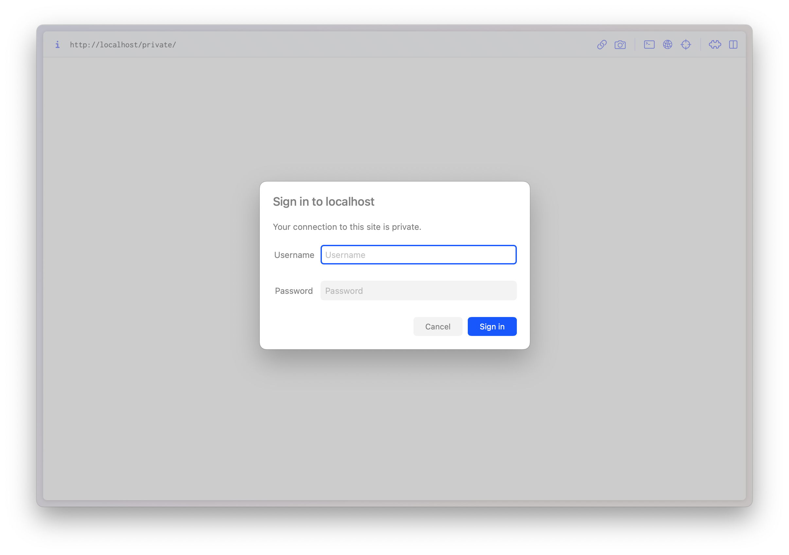
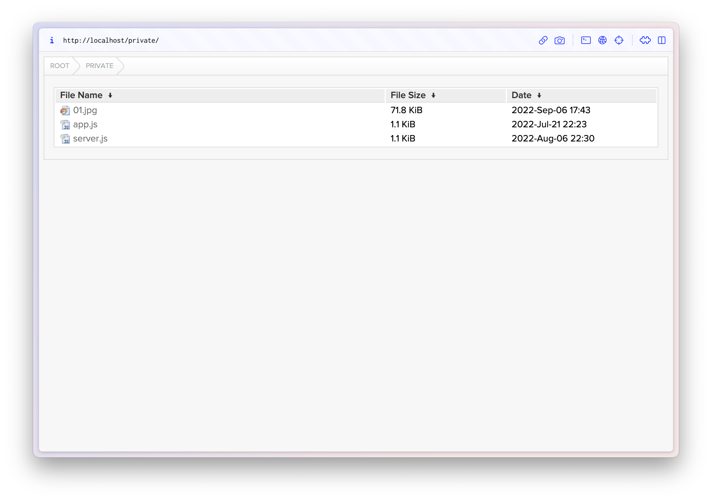
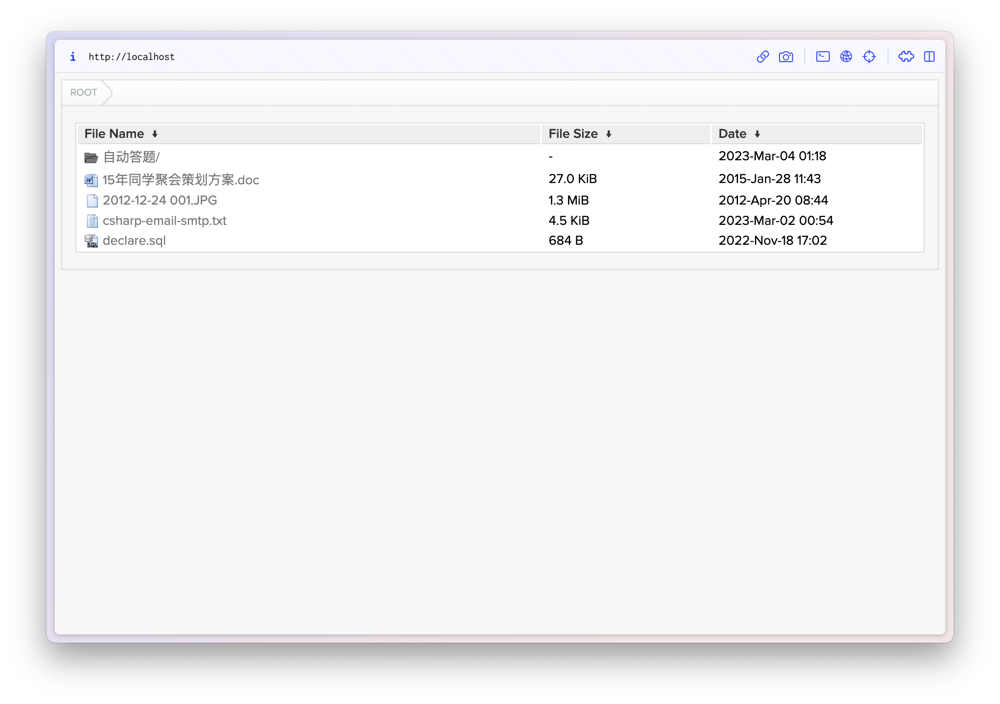

# fancyindex
Nginx with Fancyindex

http://localhost/private, Login required


http://localhost/private


http://localhost/, No user, password required


### Docker Run
```bash
docker run -d \
  --name fancyindex \
  -e PUID=3000 \
  -e PGID=3000 \
  -e TZ=Asia/Shanghai \
  -e USER=Neo \
  -e PASSWORD=RedPill$ \
  -p 80:80 \
  -p 443:443 \
  -v /zion/share/nginx/nginx.conf:/etc/nginx/nginx.conf \
  -v /zion/share/private:/private \
  -v /zion/share/public:/public \
  --restart unless-stopped \
  vonsy/fancyindex:latest
```

### Docker Compose File
```yaml
version: "2.1"
services:
  transmission:
    image: vonsy/fancyindex:1.23.3
    container_name: fancyindex
    environment:
      - PUID=3000
      - PGID=3000
      - TZ=Asia/Shanghai
      - USER=Neo
      - PASSWORD=RedPill$
    volumes:
      - /zion/share/nginx/nginx.conf:/etc/nginx/nginx.conf
      - /zion/share/private:/private
      - /zion/share/public:/public
    ports:
      - 80:80
      - 443:443
    restart: unless-stopped
```

### Docker multi-stage builds
```bash
docker build --target builder -t fancyindexbuilder:1.23.3 .
docker build -t fancyindex:1.23.3 .
```
### Multi-Arch Images
```
# Create a new builder instance named mybuilder and switch to use it
docker buildx create --name mybuilder --use

# Start (initialize) this builder
docker buildx inspect --bootstrap

# Build & Push
docker buildx build \
  --platform linux/amd64,linux/arm64 \
  -t vonsy/fancyindex:1.23.3 \
  -t vonsy/fancyindex:latest \
  . \
  --push
```

### Customized settings
If you need to customize the settings, use docker cp to copy out the nginx.conf configuration file, modify the settings and mount it.
```bash
docker cp fancyindex:/etc/nginx/nginx.conf ~/Desktop/
```


Use, reference the following programs, modules, themes, thanks.

http://nginx.org

https://github.com/aperezdc/ngx-fancyindex

https://github.com/TheInsomniac/Nginx-Fancyindex-Theme

https://github.com/vonsy/Nginx-Fancyindex-Theme, Fix Chinese display bugs

https://github.com/nginxinc/docker-nginx/blob/master/mainline/debian/Dockerfile